# Banker's Wrapped

> **Backblaze Generative Media Hackathon 2026 — Built with Genblaze on B2**

[](https://github.com/iarjunganesh/bankers-wrapped/actions/workflows/ci.yml)
[](https://codecov.io/gh/iarjunganesh/bankers-wrapped)
[](LICENSE)

[](https://www.python.org/)
[](https://fastapi.tiangolo.com/)
[](https://learn.microsoft.com/en-us/semantic-kernel/)
[](https://nodejs.org/)
[](https://nextjs.org/)
[](https://react.dev/)

[](https://bankers-wrapped-api-production.up.railway.app)
[](https://bankers-wrapped.vercel.app)

[](https://github.com/backblaze-labs/genblaze)
[](https://build.nvidia.com/)
[](https://cloud.gmi.ai/)
[](https://ffmpeg.org/)
[](https://www.backblaze.com/cloud-storage)

---

## What Is This?

Banker's Wrapped is an agentic AI platform that transforms raw transaction data into a **personalized narrated financial recap video** — fully generated, stored, and served via Backblaze B2, with every AI media call routed through the Genblaze SDK.

Upload a CSV. Receive a 60-second video that tells the story of your financial year. Inspired by Spotify Wrapped. Built for banking. Designed for production.

---

## The Problem

Banks generate mountains of transaction data but deliver it as an unreadable table. Customers disengage; apps go unused. Financial institutions lose the relationship. There is no moment that makes money *feel* meaningful.

Banker's Wrapped solves this with an agentic pipeline that reads your transactions, assigns a financial personality, writes a 4-scene narrative, synthesizes voice narration, generates scene images, and composes a sharable 60-second MP4 — end to end, no human in the loop.

---

## How It Works

1. **Upload** a CSV transaction export
2. **Document Agent** parses and normalizes transactions into typed records
3. **Analytics Agent** calculates income, expenses, savings rate, and top spending categories
4. **Financial Personality** is assigned: Builder · Optimizer · Explorer · Achiever
5. **Narrative Agent** (NVIDIA NIM / Llama 3.1 70B) generates a structured 4-scene video script
6. **Scene images** generated via **Genblaze → GMI Cloud** (Seedream 4.0, 1344×768) — all 4 in parallel
7. **Voice narration** synthesised via **Genblaze → OpenAI TTS** (tts-1, alloy voice) — concatenated scene text
8. **FFmpeg** composes the final MP4: scene images + narration audio (H.264/AAC)
9. **All artifacts** uploaded to **Backblaze B2**; presigned URL returned to user

---

## Architecture

```mermaid
graph LR
    classDef userStyle    fill:#4A90E2,stroke:#2563EB,stroke-width:2px,color:#fff;
    classDef fastapiStyle fill:#009688,stroke:#00796B,stroke-width:2px,color:#fff;
    classDef skStyle      fill:#0078D4,stroke:#005A9E,stroke-width:2px,color:#fff;
    classDef nvidiaStyle  fill:#76B900,stroke:#5A8A00,stroke-width:2px,color:#fff;
    classDef gmiStyle     fill:#0059B3,stroke:#004080,stroke-width:2px,color:#fff;
    classDef ffmpegStyle  fill:#007808,stroke:#005A06,stroke-width:2px,color:#fff;
    classDef b2Style      fill:#E8392A,stroke:#C02A1D,stroke-width:2px,color:#fff;

    u(["👤 User"]):::userStyle
    api["⚡ FastAPI<br/>POST /api/v1/recap/generate"]:::fastapiStyle
    ff["🎬 FFmpeg<br/>compose recap.mp4"]:::ffmpegStyle
    b2[("☁️ Backblaze B2<br/>user_id/session_id/")]:::b2Style

    subgraph pipeline["🤖 Agent Pipeline · Semantic Kernel"]
        direction TB
        a1["① Document Agent<br/>→ List[Transaction]"]:::skStyle
        a2["② Analytics Agent<br/>→ FinancialInsights"]:::skStyle
        a3["③ Narrative Agent<br/>NVIDIA NIM · Llama 3.1 70B<br/>→ NarrativeScript"]:::nvidiaStyle
        a4["④ Media Agent<br/>Orchestration"]:::skStyle

        a1 --> a2
        a2 --> a3
        a3 --> a4
    end

    subgraph gb["⚡ Genblaze SDK"]
        gi["🖼️ GMI Cloud Seedream<br/>scene_00…03 (parallel)"]:::gmiStyle
    end

    style pipeline fill:transparent,stroke:#0078D4,stroke-width:1.5px
    style gb fill:transparent,stroke:#0059B3,stroke-width:1.5px

    u ==>|"CSV Upload"| api
    api ==> a1

    a4 -->|"Visual Prompts × 4"| gi

    gi --> ff
    ff ==>|"recap.mp4"| b2

    a4 -.->|"CSV · Script · Images · Metadata"| b2
    b2 ==>|"Presigned URL"| u
```



### Pipeline Timing

Measured on a live run against `transactions_jan_2026.csv` (22 transactions, 4 scenes):

| Step | Agent / Service | Time |
| --- | --- | --- |
| CSV parse + normalise | DocumentAgent | < 5 ms |
| Spending analytics + personality | AnalyticsAgent | < 1 ms |
| Narrative script (4 scenes) | NarrativeAgent · NVIDIA NIM Llama 3.1 70B | ~31 s |
| Scene images × 4 **in parallel** | MediaAgent · Genblaze → GMI Cloud Seedream | ~155 s |
| MP4 composition | FFmpeg (H.264, 1792×1024, 25 fps) | ~1 s |
| B2 uploads (CSV + script + 4 PNG + MP4 + metadata) | Backblaze B2 eu-central-003 | ~2 s |
| **Total wall-clock** | | **~195 s** |

Image generation dominates. Generating all 4 scenes concurrently with `asyncio.gather` keeps total time bounded by the slowest single scene rather than their sum — a 4× speedup over sequential.

### B2 Storage Layout

```text
bankers-wrapped-assets/
└── {user_id}/{session_id}/
    ├── input/     transactions.csv
    ├── pipeline/  script.json · narration.mp3 · scenes/scene_00…03.png
    ├── output/    recap_{session_id}.mp4           ← H.264 video + AAC narration audio
    └── metadata/  session_metadata.json
```

---

## Financial Personality

The emotional centrepiece of every recap. One of four labels is assigned based on spending and saving patterns:

| Personality | Trigger | Scene 1 Hook |
| --- | --- | --- |
| **Financial Builder** | Savings rate ≥ 15% or active debt reduction | *"You're laying the foundation — brick by brick."* |
| **Financial Explorer** | Top spend in travel or entertainment | *"You invest in experiences that last a lifetime."* |
| **Financial Achiever** | Active investing or steady 8–14% savings | *"Your discipline is paying off — literally."* |
| **Financial Optimizer** | Lean discretionary spend, efficient budget | *"Every dollar has a purpose in your world."* |

The personality label opens Scene 1 and drives the entire visual and narrative tone.

---

## Genblaze Integration

Genblaze is **not optional** — it is the media generation layer. Every AI media call routes through the Genblaze Pipeline SDK. Zero direct provider API calls.

```python
# Scene images — Genblaze → GMI Cloud Seedream  (all 4 in parallel via asyncio.gather)
pr = (
    Pipeline("bankers-wrapped-image")
    .step(GMICloudImageProvider(),
          model="seedream-4-0-250828",
          prompt=scene.visual_prompt,
          modality=Modality.IMAGE,
          width=1344,
          height=768)
    .run(timeout=300, raise_on_failure=True)
)
image_bytes = httpx.get(pr.run.steps[0].assets[0].url).content

# Narration audio — OpenAI TTS wrapped inside GenblazeClient (no direct provider calls outside)
audio_result = await genblaze_client.generate_narration_audio(
    narration_text=script.full_narration,   # all 4 scene narrations joined
    model="tts-1",
    voice="alloy",
)
```

Every run produces a **SHA-256 provenance manifest** stored in B2 metadata — full model traceability per video.

---

## Provenance Metadata

Every generated video is fully traceable via `session_metadata.json`:

```json
{
  "session_id": "uuid",
  "user_id":    "uuid",
  "created_at": "2026-01-15T14:22:08Z",
  "pipeline_version": "1.0.0",
  "models_used": {
    "llm":        "nvidia-nim/meta/llama-3.1-70b-instruct",
    "image":      "gmi-cloud/seedream-4-0-250828",
    "audio":      "openai/tts-1",
    "compositor": "ffmpeg"
  },
  "input_hash":         "sha256:a3f…",
  "output_url":         "https://f000.backblazeb2.com/…",
  "processing_time_ms": 47230,
  "synthetic_data":     false
}
```

---

## Tech Stack

| Layer | Technology | Role |
| --- | --- | --- |
| **Media Generation** | [](https://github.com/backblaze-labs/genblaze) | Sole orchestrator for all AI media calls |
| **Storage** | [](https://www.backblaze.com/cloud-storage) | Structured artifact store + presigned delivery |
| **Backend** | [](https://fastapi.tiangolo.com/) [](https://www.python.org/) | Async agentic pipeline |
| **Agent Framework** | [](https://learn.microsoft.com/en-us/semantic-kernel/) | Typed plugin contracts, native async |
| **LLM** | [](https://build.nvidia.com/) | Narrative script generation |
| **Images** | [](https://cloud.gmi.ai/) | Scene visuals 1344×768, seedream-4-0-250828 (via Genblaze) — 4 parallel |
| **Video Compose** | [](https://ffmpeg.org/) | Scene images + narration audio → H.264/AAC MP4 |
| **Frontend** | [](https://nextjs.org/) [](https://react.dev/) [](https://nodejs.org/) | Upload portal + video player |
| **Session State** | [](https://sqlite.org/) [](https://www.postgresql.org/) | Pipeline state tracking (SQLite → PostgreSQL) |
| **Hosting** | [](https://railway.app) [](https://vercel.com) | Backend on Railway · Frontend on Vercel |
| **Observability** | [](https://www.structlog.org/) | Structured request + agent logging |

---

## Quick Start

```bash
# 1. Clone
git clone https://github.com/iarjunganesh/bankers-wrapped
cd bankers-wrapped

# 2. Configure
cp .env.example .env
# Fill in: GMI_API_KEY, NVIDIA_NIM_API_KEY, B2_KEY_ID, B2_APPLICATION_KEY, B2_ENDPOINT_URL

# 3. Install (requires Python 3.14 and ffmpeg)
make install

# 4. Start backend + frontend
make demo-start           # bash scripts/start_demo.sh
# — or backend only:
make dev                  # uvicorn on :8000 with hot-reload

# 5. Run the demo pipeline against both synthetic datasets
make demo                 # python scripts/demo_run.py

# 6. Stop all services when done
make demo-stop            # bash scripts/stop_demo.sh
```

On Windows, use the PowerShell equivalents directly:

```powershell
.\scripts\start_demo.ps1
python scripts\demo_run.py
.\scripts\stop_demo.ps1
```

---

## Project Structure

```text
bankers-wrapped/
├── backend/
│   ├── agents/          # 4 Semantic Kernel agents
│   ├── media/           # Genblaze client + FFmpeg compositor
│   ├── storage/         # B2 client + SQLite session store
│   ├── models/          # Pydantic models (Transaction, Insights, Script, Session)
│   ├── api/v1/          # FastAPI endpoints (recap, health)
│   └── config.py        # Pydantic Settings
├── frontend/            # Next.js upload portal + video player
├── tests/
│   ├── unit/            # Per-agent unit tests (mocked providers)
│   └── integration/     # API end-to-end tests
├── data/synthetic/      # Demo CSVs — committed, no PII
├── prompts/             # LLM system prompts (narrative_agent.txt)
├── docs/adr/            # 6 Architecture Decision Records
├── CLAUDE.md            # Claude Code project context
└── .github/
    ├── workflows/ci.yml # Lint → type-check → test → coverage
    └── prompts/         # Development prompt history
```

---

## Architecture Decision Records

Six decisions documented — see [`docs/adr/`](docs/adr/) for full rationale.

| ADR | Decision |
| --- | --- |
| [001](docs/adr/001-genblaze-central.md) | Genblaze as sole media generation layer — no direct provider calls |
| [002](docs/adr/002-semantic-kernel-orchestration.md) | Semantic Kernel for agent orchestration — typed plugins, native async |
| [003](docs/adr/003-ffmpeg-over-remotion.md) | FFmpeg for composition; Runway ML / Luma AI excluded — no quota risk |
| [004](docs/adr/004-sqlite-for-mvp.md) | SQLite for MVP, PostgreSQL as documented production upgrade |
| [005](docs/adr/005-financial-personality-core.md) | Financial Personality promoted to required scope — the emotional hook |
| [006](docs/adr/006-observability-scope.md) | structlog JSON logging only — OpenTelemetry is post-hackathon |

---

## Synthetic Demo Data

No real bank data required. Two datasets committed to [`data/synthetic/`](data/synthetic/):

| File | Period | Transactions | Personality Triggered |
| --- | --- | --- | --- |
| `transactions_jan_2026.csv` | Jan 2026 | 22 | **Financial Builder** |
| `transactions_q4_2025.csv` | Oct–Dec 2025 | 39 | **Financial Explorer** |

### CSV Schema

| Column | Type | Required | Notes |
| --- | --- | --- | --- |
| `date` | YYYY-MM-DD | ✅ | Transaction date |
| `description` | string | ✅ | Merchant or transfer description |
| `amount` | float | ✅ | Positive = income/credit, negative = expense/debit |
| `currency` | string | ❌ | ISO 4217 code (default: USD) |
| `category` | string | ❌ | Auto-inferred from description if omitted |

**Valid categories:** `income` · `savings` · `housing` · `food` · `travel` · `entertainment` · `utilities` · `investment` · `debt` · `other`

```csv
date,description,amount,currency,category
2026-01-03,Salary Deposit,6500.00,USD,income
2026-01-05,ICA Maxi Grocery,-128.40,USD,food
2026-01-15,Savings Transfer,-1200.00,USD,savings
2026-01-20,Lufthansa Flight,-312.00,USD,travel
```

```bash
# Run the full pipeline with the January demo file
make demo
# or directly via curl
curl -X POST http://localhost:8000/api/v1/recap/generate \
  -F "file=@data/synthetic/transactions_jan_2026.csv"
```

---

## CI / CD

```text
push → ruff lint → mypy type-check → pytest (≥80% coverage gate) → Codecov
```

See [`.github/workflows/ci.yml`](.github/workflows/ci.yml).

---

## Live Demo

| | |
| --- | --- |
| **App** | [https://bankers-wrapped.vercel.app](https://bankers-wrapped.vercel.app) ✅ live |
| **API** | [https://bankers-wrapped-api-production.up.railway.app](https://bankers-wrapped-api-production.up.railway.app) |
| **Demo Video** | `https://youtu.be/TBD` *(≤ 3 min, recorded before submission)* |
| **Try It Now** | `make demo` — runs the full pipeline with synthetic data, no real bank account needed |

Hackathon judging criteria and submission checklist: [`docs/SUBMISSION.md`](docs/SUBMISSION.md)

---

## Future Roadmap

- PDF statement parsing (Azure Document Intelligence)
- Goal Tracking Agent — savings milestones, debt payoff detection
- Animated video clips — Genblaze → Runway ML (post-hackathon)
- AI Banker Avatar — HeyGen personalized presenter
- Multi-region B2 deployment for production scale

---

## Disclaimer

All transaction data used in development and demonstration is **fully synthetic**. No real customer data or PII is processed, stored, or transmitted. Not affiliated with any bank or financial institution. Not financial advice.

> *Built by [Arjun Ganesh](https://github.com/iarjunganesh) for the [Backblaze Generative Media Hackathon 2026](https://backblaze-generative-media.devpost.com/).*
