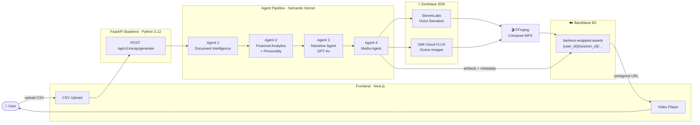
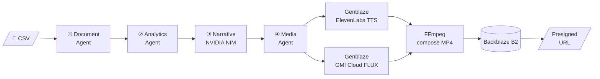
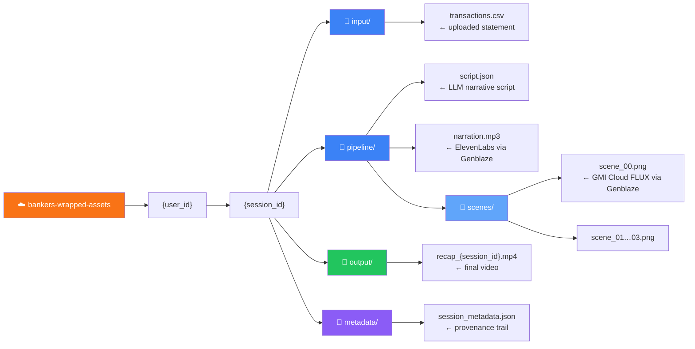

# Banker's Wrapped

**AI-Powered Financial Storytelling Platform**
Backblaze Generative Media Hackathon 2026 — Built with Genblaze on B2

---

[](https://github.com/iarjunganesh/bankers-wrapped/actions/workflows/ci.yml)
[](https://www.python.org/)
[](https://www.backblaze.com/cloud-storage)
[](https://github.com/backblaze-labs/genblaze)
[](https://build.nvidia.com/)
[](https://cloud.gmi.ai/)
[](https://codecov.io/gh/iarjunganesh/bankers-wrapped)
[](LICENSE)

---

## What Is This?

Banker's Wrapped is an agentic AI platform that transforms raw transaction data into a **personalized narrated financial recap video** — fully generated, stored, and served via Backblaze B2, with all AI media calls routed through the Genblaze SDK.

Upload a CSV. Receive a 60-second video that tells the story of your financial year.

Inspired by Spotify Wrapped. Built for banking. Designed for production.

---

## Live Demo

| | |
|---|---|
| **App** | `https://bankers-wrapped.vercel.app` *(deploy in progress)* |
| **Demo Video** | `https://youtu.be/TBD` *(≤ 3 min, recorded before submission)* |
| **Try It Now** | `make demo` — runs the full pipeline with synthetic data, no real bank account needed |

---

## How It Works

1. **Upload** a CSV transaction export
2. **Document Agent** parses and normalizes transactions into typed records
3. **Analytics Agent** calculates income, expenses, savings rate, and top spending categories
4. **Financial Personality** is assigned: Builder · Optimizer · Explorer · Achiever
5. **Narrative Agent** (NVIDIA NIM / Llama 3.1 70B) generates a structured 4-scene video script
6. **Voice narration** synthesized via **Genblaze → ElevenLabs** (`eleven_multilingual_v2`)
7. **Scene images** generated via **Genblaze → GMI Cloud** (FLUX2-Dev, 1344×768)
8. **FFmpeg** composes the final MP4: scene images + narration audio
9. **All artifacts** uploaded to **Backblaze B2**; presigned URL returned to user

---

## Architecture

### System Overview



### Agent Pipeline Detail



### Backblaze B2 Storage Layout



---

## Genblaze Integration

Genblaze is **not optional** — it is the media generation layer. Every AI media call routes through the Genblaze Pipeline SDK. Zero direct provider API calls.

```python
# Voice narration — Genblaze → ElevenLabs
Pipeline("bankers-wrapped-tts")
    .step(ElevenLabsProvider(output_dir=tmpdir),
          model="eleven_multilingual_v2",
          prompt=script.full_narration,
          modality=Modality.AUDIO,
          voice_id=voice_id,
          response_format="mp3")
    .run(timeout=90)

# Scene images — Genblaze → GMI Cloud FLUX  (one call per scene)
Pipeline("bankers-wrapped-image")
    .step(GMICloudImageProvider(output_dir=tmpdir),
          model="Flux2-Dev",
          prompt=scene.visual_prompt,
          modality=Modality.IMAGE,
          width=1344,
          height=768)
    .run(timeout=120)
```

Every run produces a **SHA-256 provenance manifest** stored in B2 metadata — full model traceability per video.

---

## Financial Personality

The emotional centrepiece of every recap. One of four labels is assigned based on spending and saving patterns:

| Personality | Trigger | Scene 1 Hook |
|---|---|---|
| **Financial Builder** | Savings rate ≥ 15% or active debt reduction | *"You're laying the foundation — brick by brick."* |
| **Financial Explorer** | Top spend in travel or entertainment | *"You invest in experiences that last a lifetime."* |
| **Financial Achiever** | Active investing or steady 8–14% savings | *"Your discipline is paying off — literally."* |
| **Financial Optimizer** | Lean discretionary spend, efficient budget | *"Every dollar has a purpose in your world."* |

The personality label opens Scene 1 and drives the entire visual and narrative tone.

---

## Provenance Metadata

Every generated video is fully traceable via `session_metadata.json`:

```json
{
  "session_id": "uuid",
  "user_id":    "uuid",
  "created_at": "2026-01-15T14:22:08Z",
  "pipeline_version": "1.0.0",
  "models_used": {
    "llm":        "nvidia-nim/meta/llama-3.1-70b-instruct",
    "tts":        "elevenlabs/eleven_multilingual_v2",
    "image":      "gmi-cloud/Flux2-Dev",
    "compositor": "ffmpeg"
  },
  "input_hash":         "sha256:a3f…",
  "output_url":         "https://f000.backblazeb2.com/…",
  "processing_time_ms": 47230,
  "synthetic_data":     false
}
```

---

## Tech Stack

| Layer | Technology | Role |
|---|---|---|
| **Media Generation** | **Genblaze SDK** | Sole orchestrator for all AI media calls |
| **Storage** | **Backblaze B2** | Structured artifact store + presigned delivery |
| **Backend** | FastAPI + Python 3.12 | Async agentic pipeline |
| **Agent Framework** | Semantic Kernel | Typed plugin contracts, native async |
| **LLM** | NVIDIA NIM / Llama 3.1 70B | Narrative script generation |
| **Voice** | ElevenLabs (via Genblaze) | `eleven_multilingual_v2` narration |
| **Images** | GMI Cloud FLUX (via Genblaze) | Scene visuals (1344×768, Flux2-Dev) |
| **Video Compose** | FFmpeg | Scene images + audio → MP4 |
| **Frontend** | Next.js 14 + React 18 | Upload portal + video player |
| **Session State** | SQLite → PostgreSQL | Pipeline state tracking |
| **Observability** | structlog (JSON) | Structured request + agent logging |

---

## Hackathon Judging Alignment

| Criterion | How Banker's Wrapped Addresses It |
|---|---|
| **Real-World Utility** | Solves chronically low engagement in banking apps — turns opaque data into a story people want to share. Clear target market: retail banks and fintechs. |
| **Production Readiness** | CI/CD with 70%+ coverage gate, structured JSON logging, health endpoint, error handling, 6 ADRs, synthetic demo data committed to repo. Not a prototype — a deployable system. |
| **B2 Storage + Orchestration** | B2 stores every pipeline artifact under a structured `{user_id}/{session_id}/` hierarchy with full provenance metadata per session. Presigned URLs serve the final video. |
| **Genblaze Usage** | Genblaze is the **sole** media generation layer — every voice synthesis and image generation call routes through the Genblaze Pipeline SDK. No provider is called directly. |

---

## Quick Start

```bash
# 1. Clone
git clone https://github.com/iarjunganesh/bankers-wrapped
cd bankers-wrapped

# 2. Configure
cp .env.example .env
# Fill in: GMI_API_KEY, ELEVENLABS_API_KEY, NVIDIA_NIM_API_KEY, B2_KEY_ID, B2_APPLICATION_KEY, B2_ENDPOINT_URL

# 3. Install (requires Python 3.12 and ffmpeg)
make install

# 4. Run
make dev        # uvicorn on :8000

# 5. Generate a recap with synthetic data
make demo
# — or directly:
curl -X POST http://localhost:8000/api/v1/recap/generate \
     -F "file=@data/synthetic/transactions_jan_2026.csv"
```

---

## Project Structure

```
bankers-wrapped/
├── backend/
│   ├── agents/          # 4 Semantic Kernel agents
│   ├── media/           # Genblaze client + FFmpeg compositor
│   ├── storage/         # B2 client + SQLite session store
│   ├── models/          # Pydantic models (Transaction, Insights, Script, Session)
│   ├── api/v1/          # FastAPI endpoints (recap, health)
│   └── config.py        # Pydantic Settings
├── frontend/            # Next.js upload portal + video player
├── tests/
│   ├── unit/            # Per-agent unit tests (mocked providers)
│   └── integration/     # API end-to-end tests
├── data/synthetic/      # Demo CSVs — committed, no PII
├── prompts/             # LLM system prompts (narrative_agent.txt)
├── docs/adr/            # 6 Architecture Decision Records
├── CLAUDE.md            # Claude Code project context
└── .github/
    ├── workflows/ci.yml # Lint → type-check → test → coverage
    └── prompts/         # Development prompt history
```

---

## Architecture Decision Records

Six decisions documented — see [`docs/adr/`](docs/adr/) for full rationale.

| ADR | Decision |
|---|---|
| [001](docs/adr/001-genblaze-central.md) | Genblaze as sole media generation layer — no direct provider calls |
| [002](docs/adr/002-semantic-kernel-orchestration.md) | Semantic Kernel for agent orchestration — typed plugins, native async |
| [003](docs/adr/003-ffmpeg-over-remotion.md) | FFmpeg for composition; Runway ML / Luma AI excluded — no quota risk |
| [004](docs/adr/004-sqlite-for-mvp.md) | SQLite for MVP, PostgreSQL as documented production upgrade |
| [005](docs/adr/005-financial-personality-core.md) | Financial Personality promoted to required scope — the emotional hook |
| [006](docs/adr/006-observability-scope.md) | structlog JSON logging only — OpenTelemetry is post-hackathon |

---

## Synthetic Demo Data

No real bank data required. Two datasets committed to [`data/synthetic/`](data/synthetic/):

| File | Personality Triggered |
|---|---|
| `transactions_jan_2026.csv` — 25 txns, USD, Jan 2026 | **Financial Builder** |
| `transactions_q4_2025.csv` — 80 txns, Q4 2025 | **Financial Explorer** |

```csv
date,description,amount,currency,category
2026-01-03,Salary Deposit,6500.00,USD,income
2026-01-05,ICA Maxi Grocery,-128.40,USD,food
2026-01-15,Savings Transfer,-1200.00,USD,savings
2026-01-20,Lufthansa Flight,-312.00,USD,travel
```

---

## CI / CD

```
push → ruff lint → mypy type-check → pytest (≥70% coverage gate) → Codecov
```

See [`.github/workflows/ci.yml`](.github/workflows/ci.yml).

---

## Future Roadmap

- PDF statement parsing (Azure Document Intelligence)
- Multi-language narration (Swedish, Hindi, German via ElevenLabs)
- Goal Tracking Agent — savings milestones, debt payoff detection
- Animated video clips — Genblaze → Runway ML (post-hackathon)
- AI Banker Avatar — HeyGen personalized presenter
- Multi-region B2 deployment for production scale

---

## Disclaimer

All transaction data used in development and demonstration is **fully synthetic**. No real customer data or PII is processed, stored, or transmitted. Not affiliated with any bank or financial institution. Not financial advice.

> *Built by [Arjun Ganesh](https://github.com/iarjunganesh) for the [Backblaze Generative Media Hackathon 2026](https://backblaze-generative-media.devpost.com/).*
