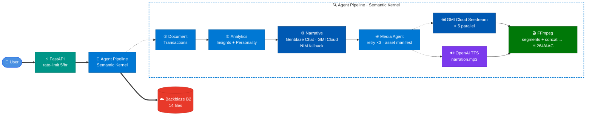
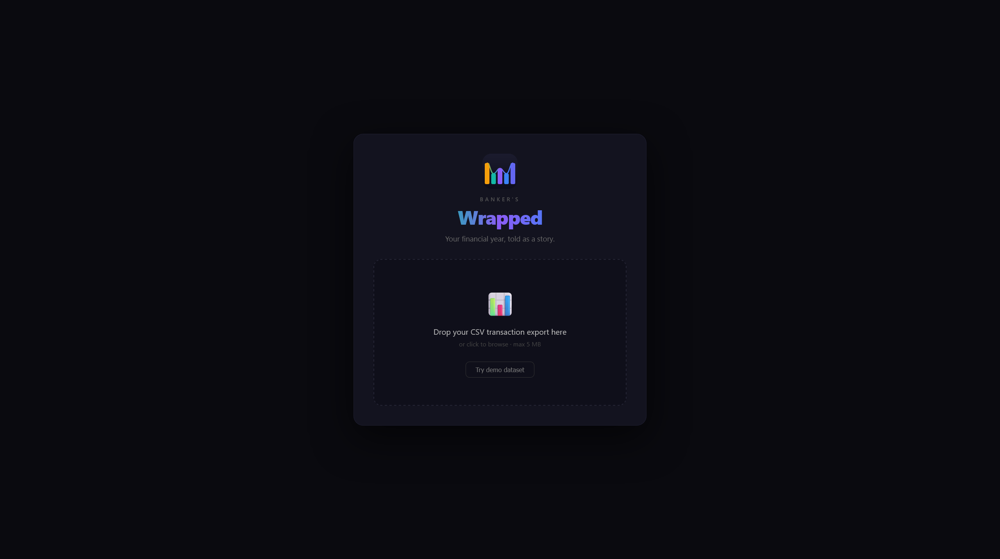
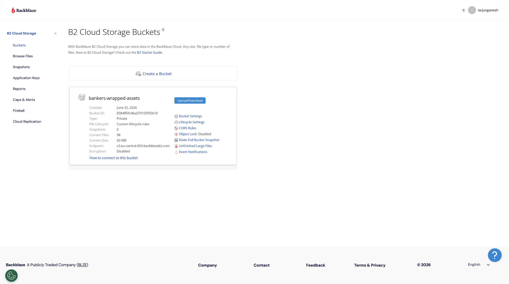
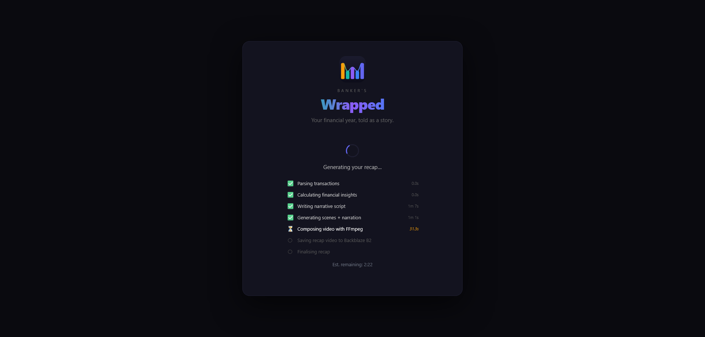
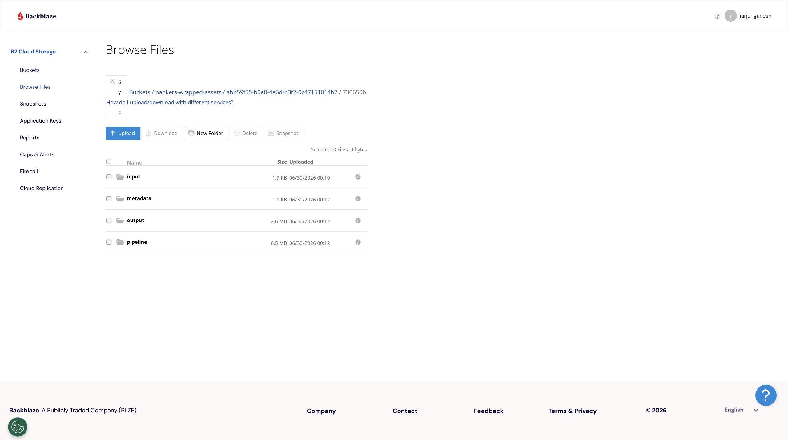
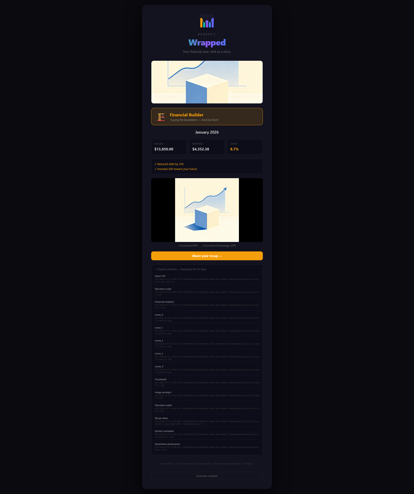
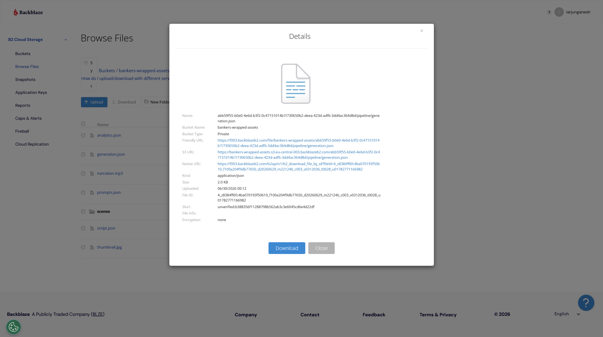

# Banker's Wrapped

<p align="center">
  
</p>

<p align="center">
  <strong>Turn every transaction into a cinematic money story people remember.</strong>
</p>

> **Backblaze Generative Media Hackathon 2026 — Built with Genblaze on B2**

[](https://github.com/iarjunganesh/bankers-wrapped/actions/workflows/ci.yml)
[](https://codecov.io/gh/iarjunganesh/bankers-wrapped)
[](https://github.com/iarjunganesh/bankers-wrapped/releases/latest)
[](LICENSE) [](#)

[](https://www.backblaze.com/cloud-storage)
[](https://github.com/backblaze-labs/genblaze)
[](https://cloud.gmi.ai/)
[](https://build.nvidia.com/)
[](https://platform.openai.com/)
[](https://ffmpeg.org/)
[](https://learn.microsoft.com/en-us/semantic-kernel/)
[](https://plaid.com/)

[](https://react.dev/)
[](https://nextjs.org/)
[](https://nodejs.org/)
[](https://bankers-wrapped.vercel.app)

[](https://www.python.org/)
[](https://fastapi.tiangolo.com/)
[](https://bankers-wrapped-api-production.up.railway.app)

---

## Interactive Demo Notebook

[](notebooks/DEMO_RUNBOOK.ipynb)

**[`notebooks/DEMO_RUNBOOK.ipynb`](notebooks/DEMO_RUNBOOK.ipynb)** — a self-contained interactive walkthrough of the full pipeline. No frontend, no local backend required. Just set your API keys and run against the live Railway deployment.

| Scenario | API cost | Time | What you'll see |
| --- | --- | --- | --- |
| **A — Financial Builder** (Jan 2026) | LLM + 5 images + TTS | ~2–3 min | Full end-to-end run · amber personality · 5-scene video |
| **B — Financial Explorer** (Q4 2025) | LLM + 5 images + TTS | ~2–3 min | Second personality type · teal theme · 39-transaction dataset |
| **C — Pre-generated session** | **None** | < 5 s | Fetch a completed session from B2 · inspect all 14 artifacts |
| Comparison chart | — | instant | Income vs expenses side-by-side across both datasets |
| Timing chart | — | instant | Where the ~2 min goes — image generation dominates |
| B2 inspection | — | instant | Full 14-file (10-type) B2 layout printed per session |

```bash
# Run against the live production API — no local setup needed
pip install httpx matplotlib jupyter
jupyter notebook notebooks/DEMO_RUNBOOK.ipynb
```

---

## What Is This?

Banker's Wrapped is an agentic AI platform that transforms raw transaction data into a **personalized narrated financial recap video** — fully generated, stored, and served via Backblaze B2, with every AI media call routed through the Genblaze SDK.

Upload a CSV. Receive a 60-second video that tells the story of your financial year. Inspired by Spotify Wrapped. Built for banking. Designed for production.

---

## The Problem

Banks generate mountains of transaction data but deliver it as an unreadable table. Customers disengage; apps go unused. Financial institutions lose the relationship. There is no moment that makes money *feel* meaningful.

Banker's Wrapped solves this with an agentic pipeline that reads your transactions, assigns a financial personality, writes a 5-scene cinematic narrative, synthesizes voice narration, generates scene images, and composes a sharable MP4 with cinematic dip-to-black transitions — end to end, no human in the loop.

---

## How It Works

1. **Upload** a CSV transaction export — or **connect a bank via Plaid Sandbox** (zero setup, no real credentials; the connector normalises Plaid transactions into the same schema)
2. **Document Agent** parses and normalizes transactions into typed records
3. **Analytics Agent** calculates income, expenses, savings rate, and top spending categories
4. **Financial Personality** is assigned: Builder · Optimizer · Explorer · Achiever
5. **Narrative Agent** generates a structured **5-scene cinematic video script** (Opening → Achievement → Insight → Advice → Close) — routed through **Genblaze chat** (ADR-007) on **GMI Cloud** (`openai/gpt-5.4-mini`), with automatic **NVIDIA NIM fallback** on provider failure or invalid JSON
6. **Scene images** generated via **Genblaze → GMI Cloud** (Seedream 4.0, 1344×768) — all 5 in parallel (with automatic 3× retry + exponential backoff)
7. **Voice narration** synthesised via **Genblaze → OpenAI TTS** (tts-1, alloy voice) — concatenated scene text
8. **FFmpeg** composes the final MP4: each scene rendered to a segment, then concat-joined with narration — **dip-to-black** transitions between scenes, browser-safe H.264 `yuv420p` + `faststart` / AAC (memory-bounded so it runs on any host)
9. **14 files** (10 artifact types) uploaded to **Backblaze B2** (video, thumbnail, script, analytics, prompts, generation provenance, 5 scenes, narration, CSV, metadata); presigned URL + download ZIP returned

---

## Architecture



### Pipeline Timing

Measured on a live run against `transactions_jan_2026.csv` (22 transactions, 5 scenes):

| Step | Agent / Service | Time |
| --- | --- | --- |
| CSV parse + normalise | DocumentAgent | < 1 s |
| Spending analytics + personality | AnalyticsAgent | < 1 s |
| Narrative script (5 scenes) | NarrativeAgent · Genblaze chat → GMI `openai/gpt-5.4-mini` (NIM fallback) | ~30 s |
| Scene images × 5 | MediaAgent · Genblaze → GMI Cloud Seedream (parallel, retry ×3) | ~45–180 s |
| Voice narration | GenblazeClient → OpenAI TTS (tts-1, alloy, retry ×3) | ~17 s |
| MP4 composition | FFmpeg (H.264/AAC, segment + concat, dip-to-black) | ~6 s |
| B2 uploads (14 files) | Backblaze B2 | ~3 s |
| **Total wall-clock** | | **~2–4 min** |

Image generation dominates. Since v1.6.0 the blocking image-gen call is offloaded to a worker thread, so `asyncio.gather` truly dispatches all 5 scenes concurrently (previously the event loop serialized them). Wall time now depends on GMI Cloud's server-side concurrency per API key. Per-step latency and retry counts are recorded in `generation.json`.

### B2 Storage Layout

Every recap produces **14 files** (10 artifact types) — B2 is the complete source of truth for the entire media pipeline:

```text
bankers-wrapped-assets/
├── index/{session_id}.json           ← flat session→user index (ADR-008: B2 is the source of truth)
└── {user_id}/{session_id}/
    ├── input/
    │   └── transactions.csv
    ├── pipeline/
    │   ├── script.json           ← narrative script (5 scenes)
    │   ├── analytics.json        ← financial insights snapshot
    │   ├── prompts.json          ← image prompts + SHA-256 hashes per scene
    │   ├── generation.json       ← model, provider, latency, retry count per step
    │   ├── thumbnail.jpg         ← scene 0 (a JPEG) reused as recap preview image
    │   ├── narration.mp3         ← OpenAI TTS (alloy voice)
    │   └── scenes/
    │       ├── scene_00.jpg … scene_04.jpg   ← GMI Cloud Seedream
    ├── output/
    │   └── recap_{session_id}.mp4   ← H.264 yuv420p + faststart / AAC, dip-to-black transitions
    └── metadata/
        └── session_metadata.json    ← top-level provenance record
```

### B2 Data Lifecycle & Integrity

- **Retention (ADR-009):** a bucket lifecycle rule (committed as [`infra/b2-lifecycle.json`](infra/b2-lifecycle.json), applied idempotently via `uv run python scripts/apply_b2_lifecycle.py`) expires session artifacts **45 days after upload** — long enough that every hackathon-period session outlives the judging window, short enough that storage stays near zero afterwards.
- **Integrity:** `generation.json` records a **SHA-256 per stored artifact** (key, size, hash — 12 content artifacts per session). To verify any download: `sha256sum scene_00.jpg` and compare against the `artifacts` entry for that key. The two manifests themselves (`generation.json`, `session_metadata.json`) are the verification root and are not self-listed.

---

## Financial Personality

The emotional centrepiece of every recap. One of four labels is assigned based on spending and saving patterns:

| Personality | Trigger | Scene 1 Hook |
| --- | --- | --- |
| **Financial Builder** | Savings rate ≥ 15% or active debt reduction | *"You're laying the foundation — brick by brick."* |
| **Financial Explorer** | Top spend in travel or entertainment | *"You invest in experiences that last a lifetime."* |
| **Financial Achiever** | Active investing or steady 8–14% savings | *"Your discipline is paying off — literally."* |
| **Financial Optimizer** | Lean discretionary spend, efficient budget | *"Every dollar has a purpose in your world."* |

The personality label opens Scene 1 and drives the entire visual and narrative tone.

---

## Genblaze Integration

Genblaze is **not optional** — it is the AI orchestration layer. **Three of the four AI steps route through Genblaze**: scene images (GMI Cloud Seedream), narration audio (OpenAI TTS wrapped in `GenblazeClient`), and narrative script generation (Genblaze chat on GMI Cloud — `openai/gpt-5.4-mini` — with automatic NVIDIA NIM fallback via the same SDK wrapper). Zero direct provider API calls outside `genblaze_client.py`.

```python
# Scene images — Genblaze → GMI Cloud Seedream  (all 5 in parallel via asyncio.gather)
pr = (
    Pipeline("bankers-wrapped-image")
    .step(GMICloudImageProvider(),
          model="seedream-4-0-250828",
          prompt=scene.visual_prompt,
          modality=Modality.IMAGE,
          width=1344,
          height=768)
    .run(timeout=300, raise_on_failure=True)
)
image_bytes = httpx.get(pr.run.steps[0].assets[0].url).content

# Narration audio — OpenAI TTS wrapped inside GenblazeClient (no direct provider calls outside)
audio_result = await genblaze_client.generate_narration_audio(
    narration_text=script.full_narration,   # all 5 scene narrations joined
    model="tts-1",
    voice="alloy",
)
```

Every run produces a **SHA-256 provenance manifest** stored in B2 metadata — full model traceability per video.

---

## Provenance Metadata

Every run produces **four machine-readable provenance files** in B2:

**`session_metadata.json`** — top-level record:

```json
{
  "session_id": "uuid",
  "user_id":    "uuid",
  "created_at": "2026-01-15T14:22:08Z",
  "pipeline_version": "1.0.0",
  "models_used": {
    "llm":        "gmi-cloud/openai/gpt-5.4-mini",
    "image":      "gmi-cloud/seedream-4-0-250828",
    "audio":      "openai/tts-1",
    "compositor": "ffmpeg"
  },
  "input_hash":         "sha256:a3f…",
  "output_url":         "https://f000.backblazeb2.com/…",
  "processing_time_ms": 47230,
  "synthetic_data":     false
}
```

**`generation.json`** — per-step model telemetry (latency, retries, manifest hashes):

```json
{
  "images": [
    { "scene_idx": 0, "model": "seedream-4-0-250828", "provider": "gmi-cloud",
      "latency_ms": 32400, "retry_count": 0, "manifest_hash": "sha256:…", "success": true }
  ],
  "audio":      { "model": "tts-1", "provider": "openai", "latency_ms": 6900, "retry_count": 0 },
  "compositor": { "tool": "ffmpeg", "scenes": 5, "latency_ms": 2100, "success": true }
}
```

**`prompts.json`** — all image prompts with SHA-256 hashes for full reproducibility.

**`analytics.json`** — financial insights snapshot (income, expenses, savings rate, personality).

---

## Tech Stack

| Layer | Technology | Role |
| --- | --- | --- |
| **Media Generation** | [](https://github.com/backblaze-labs/genblaze) | Sole orchestrator for all AI media calls |
| **Storage** | [](https://www.backblaze.com/cloud-storage) | Structured artifact store + presigned delivery |
| **Backend** | [](https://fastapi.tiangolo.com/) [](https://www.python.org/) | Async agentic pipeline |
| **Agent Framework** | [](https://learn.microsoft.com/en-us/semantic-kernel/) | Typed plugin contracts, native async |
| **LLM** | [](https://github.com/backblaze-labs/genblaze) [](https://build.nvidia.com/) | Narrative script — Genblaze SDK chat on GMI Cloud (`openai/gpt-5.4-mini`), automatic NVIDIA NIM fallback |
| **Images** | [](https://cloud.gmi.ai/) | Scene visuals 1344×768, seedream-4-0-250828 (via Genblaze) — 5 parallel, retry ×3 |
| **Video Compose** | [](https://ffmpeg.org/) | Scene images + narration → H.264/AAC MP4 (segment + concat, dip-to-black) |
| **Frontend** | [](https://nextjs.org/) [](https://react.dev/) [](https://nodejs.org/) | Upload portal + video player |
| **Session State** | [](https://www.backblaze.com/cloud-storage) [](https://sqlite.org/) | B2 manifest is the durable record (ADR-008); SQLite is a fast read cache |
| **Hosting** | [](https://railway.app) [](https://vercel.com) | Backend on Railway · Frontend on Vercel |
| **Observability** | [](https://www.structlog.org/) | Structured request + agent logging |

---

## Quick Start

```bash
# 1. Clone
git clone https://github.com/iarjunganesh/bankers-wrapped
cd bankers-wrapped

# 2. Configure
cp .env.example .env
# Fill in: GMI_API_KEY, NVIDIA_NIM_API_KEY, B2_KEY_ID, B2_APPLICATION_KEY, B2_ENDPOINT_URL

# 3. Install (requires Python 3.14 and ffmpeg)
make install

# 4. Start backend + frontend
make demo-start           # bash scripts/start_demo.sh
# — or backend only:
make dev                  # uvicorn on :8000 with hot-reload

# 5. Run the demo pipeline against both synthetic datasets
make demo                 # python scripts/demo_run.py

# 6. Stop all services when done
make demo-stop            # bash scripts/stop_demo.sh
```

On Windows, use the PowerShell equivalents directly:

```powershell
.\scripts\start_demo.ps1
python scripts\demo_run.py
.\scripts\stop_demo.ps1
```

---

## Project Structure

```text
bankers-wrapped/
├── backend/
│   ├── agents/          # 4 typed async agents (Document, Analytics, Narrative, Media)
│   ├── api/
│   │   ├── limiter.py   # slowapi rate limiter (5 req/hr/IP)
│   │   ├── middleware/  # Request logging
│   │   └── v1/
│   │       ├── recap.py    # POST /generate · GET /{session_id} (B2 fallback) · /download ZIP
│   │       ├── progress.py # GET /{session_id}/progress (SSE)
│   │       ├── plaid.py    # POST /plaid/link-token · /plaid/exchange (feature-flagged)
│   │       └── health.py   # status + version + plaid_enabled
│   ├── ingest/          # PlaidConnector — sandbox "connect a bank" path (ADR-010)
│   ├── media/           # GenblazeClient (images + chat + TTS) · FFmpegComposer
│   ├── storage/         # B2Client (source of truth) · SessionStore (SQLite cache)
│   ├── models/          # Pydantic models (Transaction, Insights, Script, Session)
│   └── config.py        # Pydantic Settings
├── frontend/
│   └── app/
│       ├── page.tsx                    # Upload portal + Plaid Link + live SSE progress
│       └── recap/[session_id]/page.tsx # Public share page
├── tests/
│   ├── unit/            # Per-agent unit tests (all providers mocked)
│   ├── integration/     # API end-to-end tests (incl. B2-fallback + SSE stream)
│   └── load/            # k6 smoke test (manual — p95 + rate-limiter behavior)
├── infra/               # b2-lifecycle.json — bucket retention as code (ADR-009)
├── scripts/             # demo_run · apply_b2_lifecycle · recompose · start/stop_demo
├── notebooks/           # DEMO_RUNBOOK.ipynb — interactive pipeline walkthrough
├── data/synthetic/      # Demo CSVs — committed, no PII
├── prompts/             # LLM system prompts (narrative_agent.txt)
├── docs/
│   ├── adr/             # 11 Architecture Decision Records (9 accepted)
│   ├── COSTS.md         # Component budget — everything stays live through judging
│   ├── SUBMISSION.md    # Judging alignment + deliverables checklist
│   └── DEVPOST.md       # Devpost form content + demo video script
├── Dockerfile           # python:3.14-slim + FFmpeg + uv
├── railway.json         # Railway backend deployment
├── render.yaml          # Render backend deployment (alternative)
├── CLAUDE.md            # Claude Code project context
└── .github/
    ├── workflows/ci.yml # Lint → type-check → test (≥80% coverage gate) → Codecov
    └── prompts/         # Development prompt history (1–16)
```

---

## Architecture Decision Records

Eleven decisions documented (001–006, 008, 009, 011 accepted; 007 and 010 proposed) — see [`docs/adr/`](docs/adr/) for full rationale.

| ADR | Decision |
| --- | --- |
| [001](docs/adr/001-genblaze-central.md) | Genblaze as sole media generation layer — no direct provider calls |
| [002](docs/adr/002-semantic-kernel-orchestration.md) | Semantic Kernel for agent orchestration — typed plugins, native async |
| [003](docs/adr/003-ffmpeg-over-remotion.md) | FFmpeg for composition; Runway ML / Luma AI excluded (impl revised in v1.6.0) |
| [004](docs/adr/004-sqlite-for-mvp.md) | SQLite for MVP, PostgreSQL as documented production upgrade |
| [005](docs/adr/005-financial-personality-core.md) | Financial Personality promoted to required scope — the emotional hook |
| [006](docs/adr/006-observability-scope.md) | structlog JSON logging only — OpenTelemetry is post-hackathon |
| [007](docs/adr/007-genblaze-sole-ai-layer.md) | *(proposed)* Route the narrative LLM through Genblaze — sole AI layer |
| [008](docs/adr/008-b2-source-of-truth.md) | B2 as session source of truth — SQLite is a cache; sessions survive redeploys |
| [009](docs/adr/009-b2-lifecycle-integrity.md) | B2 lifecycle rules (45-day retention) + per-artifact SHA-256 integrity |
| [010](docs/adr/010-plaid-sandbox-ingestion.md) | *(proposed)* Plaid sandbox connector — optional "connect a bank" path |
| [011](docs/adr/011-compositor-redesign.md) | Memory-bounded segment+concat compositor + non-blocking event loop (v1.6.0 redesign) |

---

## Synthetic Demo Data

No real bank data required. Two datasets committed to [`data/synthetic/`](data/synthetic/):

| File | Period | Transactions | Personality Triggered |
| --- | --- | --- | --- |
| `transactions_jan_2026.csv` | Jan 2026 | 22 | **Financial Builder** |
| `transactions_q4_2025.csv` | Oct–Dec 2025 | 39 | **Financial Explorer** |

### CSV Schema

| Column | Type | Required | Notes |
| --- | --- | --- | --- |
| `date` | YYYY-MM-DD | ✅ | Transaction date |
| `description` | string | ✅ | Merchant or transfer description |
| `amount` | float | ✅ | Positive = income/credit, negative = expense/debit |
| `currency` | string | ❌ | ISO 4217 code (default: USD) |
| `category` | string | ❌ | Auto-inferred from description if omitted |

**Valid categories:** `income` · `savings` · `housing` · `food` · `travel` · `entertainment` · `utilities` · `investment` · `debt` · `other`

```csv
date,description,amount,currency,category
2026-01-03,Salary Deposit,6500.00,USD,income
2026-01-05,ICA Maxi Grocery,-128.40,USD,food
2026-01-15,Savings Transfer,-1200.00,USD,savings
2026-01-20,Lufthansa Flight,-312.00,USD,travel
```

```bash
# Run the full pipeline with the January demo file
make demo
# or directly via curl
curl -X POST http://localhost:8000/api/v1/recap/generate \
  -F "file=@data/synthetic/transactions_jan_2026.csv"
```

---

## CI / CD

```text
push → ruff lint → mypy type-check → pytest (≥80% coverage gate) → Codecov
```

See [`.github/workflows/ci.yml`](.github/workflows/ci.yml).

### Load Testing (manual, not in CI)

[`tests/load/k6_smoke.js`](tests/load/k6_smoke.js) ramps 20 concurrent users against `/health` (threshold: p95 < 500 ms), exercises the B2 fallback 404 path, and verifies the rate limiter answers `/generate` abuse with graceful 429s (never 5xx):

```bash
winget install k6   # or: brew install k6
k6 run tests/load/k6_smoke.js                                  # local backend
k6 run -e BASE_URL=https://<railway-url> tests/load/k6_smoke.js  # production
```

---

## Live Demo

| | |
| --- | --- |
| **App** | [https://bankers-wrapped.vercel.app](https://bankers-wrapped.vercel.app) ✅ live |
| **API** | [https://bankers-wrapped-api-production.up.railway.app](https://bankers-wrapped-api-production.up.railway.app) |
| **Demo Video** | `https://youtu.be/TBD` *(≤ 3 min, recorded before submission)* |
| **Try It Now** | `make demo` — runs the full pipeline with synthetic data, no real bank account needed |

Hackathon judging criteria and submission checklist: [`docs/SUBMISSION.md`](docs/SUBMISSION.md)

---

## Screenshots

Judge-facing screenshots and raw evidence are organized in [`assets/README.md`](assets/README.md).

| Product Flow | B2 Provenance |
| --- | --- |
|  |  |
|  |  |
|  |  |

---

## Future Roadmap

**v1.8.0 shipped**: all v1.7.0 roadmap workstreams are now implemented, including optional Plaid Sandbox ingestion alongside CSV input. See [CHANGELOG 1.8.0](CHANGELOG.md) and [v1.7.0 plan](docs/ROADMAP-v1.7.0.md) for traceability.

Beyond v1.8.0:

- PDF statement parsing (Azure Document Intelligence)
- Goal Tracking Agent — savings milestones, debt payoff detection
- Animated video clips — Genblaze → Runway ML (post-hackathon)
- AI Banker Avatar — HeyGen personalized presenter
- Multi-region B2 deployment for production scale

---

## Disclaimer

All transaction data used in development and demonstration is **fully synthetic**. No real customer data or PII is processed, stored, or transmitted. Not affiliated with any bank or financial institution. Not financial advice.

> *Built by [Arjun Ganesh](https://github.com/iarjunganesh) for the [Backblaze Generative Media Hackathon 2026](https://backblaze-generative-media.devpost.com/).*
